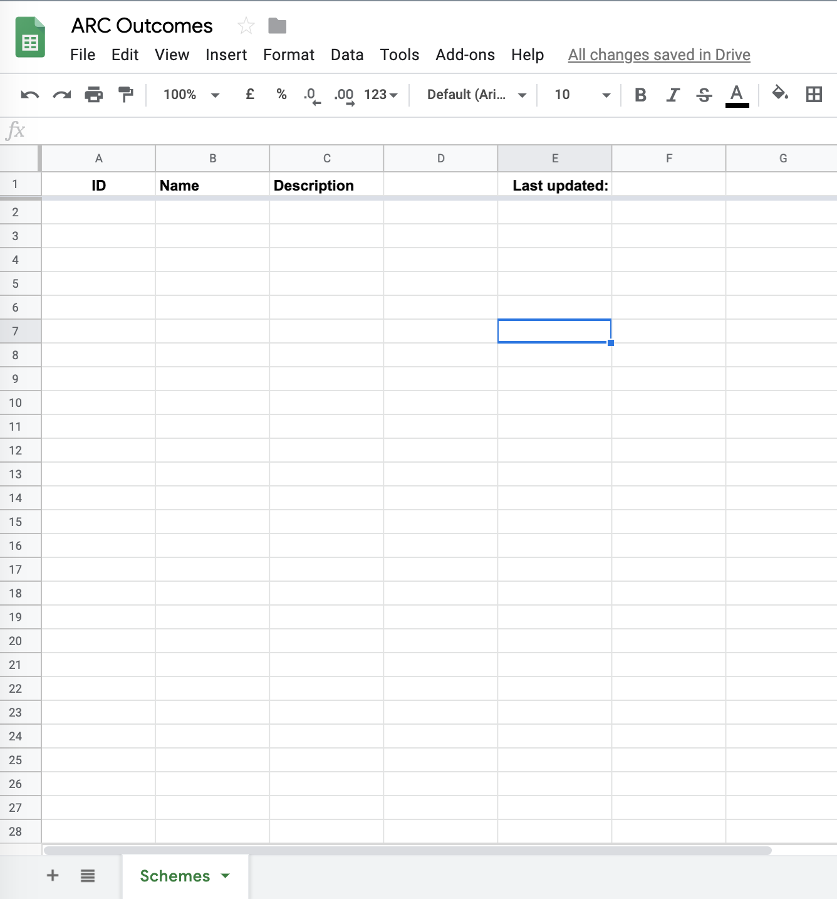
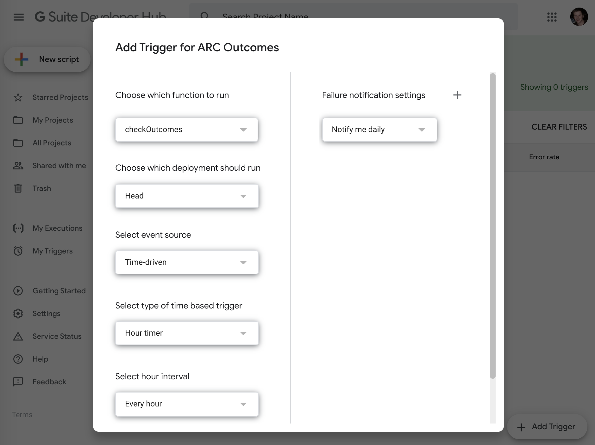
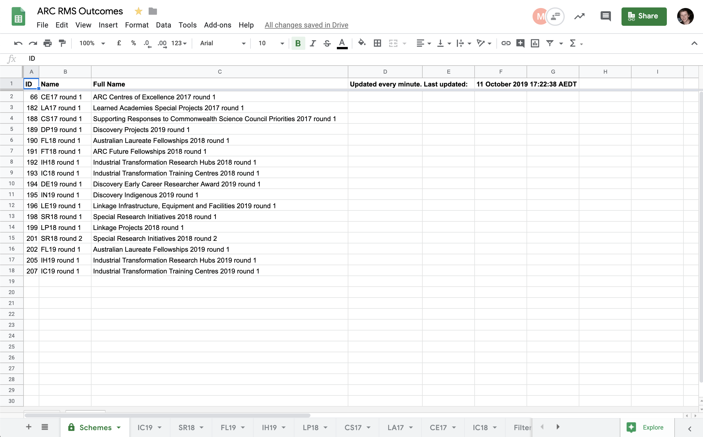

The [Australian Research Council](http://arc.gov.au) (ARC) administers the [National Competitive Grants Program](https://www.arc.gov.au/grants/national-competitive-grants-program) (NCGP), a significant component of Australia's investment in research and development.

Normally there's no warning when grants will be announced. They could be announced at any time. Researchers spend months sitting on the edge of their seat wondering whether they need to start looking for a new job or not. And university staff often have babysitters on call (for months, paid from their own pockets) so that they're available to produce reports and press releases the moment funding is announced.

That's crazy. Let's automate that.

> [!WARNING]
> It's reasonable that Ministers have discretion in announcement funding. It's also reasonable that researchers know when funding will be announced _by_. It's important for research productivity and their mental health. This post is not a comment on whether the current system is _good_ or _bad_. This is just the state of the system.
>
> **It is also worth noting that the ARC has improved its processes since this note was first published.**


I doubt many researchers know that the ARC has a RESTful Application Programming Interface (API). The API makes it trivial to see when outcomes from a new scheme are announced, and to access data about successful applications. We don't need to write complicated HTML parsers to scrape the data. We can request it simply, and retrieve data back in a nice format (JSON).

You could do this with a cron job, but I'd prefer not to use my personal or work computing infrastructure for this. I also never want to have to think about whether a system needs rebooting, patches, upgrades, etc, for something this minor. I never want to have to think about it. I want it to Just Work&trade;. For these reasons - believe it or not - I'm going to use Google Sheets (and Google App Script).

## Google Apps Script
[Google Apps Script](https://developers.google.com/apps-script) lets you write complex applications that seamlessly integrate with Google's products. It's free. All you need to do is write code. The infrastructure is handled by Google. You can create an application with a public-facing website, or have an application run in the background at specific times or frequencies (i.e., like a cron job).

Here we will make an application that will check the ARC website every hour for new scheme announcements. If there are new outcomes available then it will store all the awarded grants in a Google Sheet, which is helpful for when the ARC website slows down as many people try to access it. The application will also email me to tell me that new outcomes are available.

{}

### Create a Google Sheet

Let's call it *ARC Outcomes*. You'll also need to rename the first sheet from *Sheet1* to *Schemes*. Style your *Schemes* sheet something like this:




  Now go to the Tools menubar, and select "Script Editor". That will open a new tab and create a new App Script project called *Untitled Project*. For consistency let's name the project *ARC Outcomes*. Currently the project will just have one file called <code>Code.js</code>, which will contain something like this:

```javascript
function myFunction() {
  
}
```

### Get the ID of the Google Sheet you just created.
 To get the ID, go to the Google Sheet and look at the URL in the address bar. It should look something like:

```
https://docs.google.com/spreadsheets/d/1C_BeM8R4v5MS1mGl0NbTmuxEjMFVy1b-PDpGgBqSjYE/edit#gid=0
```

The ID is between <code>d/</code> and <code>/edit#</code>. In this case, our ID is <code>1C_BeM8R4v5MS1mGl0NbTmuxEjMFVy1b-PDpGgBqSjYE</code>. Store this in a global variable like this:

```javascript
  var logger = console; // Use Logger for immediate logs, console for StackDriver logs (better).
  var GLOBAL = {
    spreadsheetID: "1C_BeM8R4v5MS1mGl0NbTmuxEjMFVy1b-PDpGgBqSjYE",
    emailRecipients: "andrew.casey@monash.edu",
    rmsURL: "https://rms.arc.gov.au/RMS/Report/DataProvider/GetData"
  };
```

### Write a function to check for new grant outcomes

```javascript
function checkOutcomes() {
  var response = UrlFetchApp.fetch(GLOBAL.rmsURL + "?providerID=announcedSchemeRoundListProvider");
  var schemes = JSON.parse(response.getContentText());

  // Check for any new schemes?
  logger.log("Status of RMS website: " + schemes.status);
  logger.log(response);
  
  // Get existing schemes from spreadsheet.
  var spreadsheet = SpreadsheetApp.openById(GLOBAL.spreadsheetID),
      schemesSheet = spreadsheet.getSheetByName("Schemes"),
      existingSchemeIDs = [].concat.apply([], schemesSheet.getRange("A2:A1000").getValues()).filter(Boolean),
      nextRowID = 2 + existingSchemeIDs.length;
  
  logger.log("Existing scheme IDs: " + existingSchemeIDs);
  logger.log("Next row ID: " + nextRowID);
  
  JSON.parse(schemes.data).forEach(function(scheme) {    
    if (existingSchemeIDs.indexOf(scheme.Id) < 0) {
      // New scheme  
      logger.log("New scheme: " + scheme.FullName + " (" + scheme.Name + "; " + scheme.Id + ")");
      
      // Send email about new scheme
      MailApp.sendEmail(
        GLOBAL.emailRecipients,
        "ARC Outcomes available for " + scheme.Name + " (" + scheme.FullName + ")",
        "Dear colleague,\n\n" + 
        "Outcomes are now available for " + scheme.FullName + " (" + scheme.Name + ")." + 
        "The outcomes have been populated in the following spreadsheet:\n\n" +
        "https://docs.google.com/spreadsheets/d/" + GLOBAL.spreadsheetID + "/edit?usp=sharing")

      // Prepare to create a sheet.
      var sheetName = scheme.Name.split(" ")[0],
          sheet = spreadsheet.getSheetByName(sheetName);
      
      if (sheet != null) {
        // Delete any existing sheet of the same name
        spreadsheet.deleteSheet(sheet);
      }
      
      // Create a fresh sheet and insert after Schemes
      sheet = spreadsheet.insertSheet(1);
      sheet.setName(sheetName);
      
      // Get outcomes for that scheme and put it in the sheet
      updateOutcomes(scheme.Id, scheme.Name);
      
      // Add to the summary scheme sheet now that we are done
      schemesSheet.getRange("A" + nextRowID).setValue(scheme.Id);
      schemesSheet.getRange("B" + nextRowID).setValue(scheme.Name);
      schemesSheet.getRange("C" + nextRowID).setValue(scheme.FullName);
      nextRowID = nextRowID + 1;
    }
    else {
      logger.log("Existing scheme: " + scheme.Name + " (" + scheme.FullName + "; " + scheme.Id + ")");
    }
  });
  
  // Update the 'last updated' time.
  schemesSheet.getRange("F1").setValue((new Date()).toLocaleString());
}
```

### Write a function to run when there are new grant outcomes

Now write a <code>updateOutcomes()</code> function to run when new outcomes are available

```javascript
function updateOutcomes(schemeID, schemeName) {
  logger.log("Retrieving outcomes for scheme " + schemeID + " (" + schemeName + ")"); 

  var spreadsheet = SpreadsheetApp.openById(GLOBAL.spreadsheetID),
      sheetName = schemeName.split(" ")[0],
      sheet = spreadsheet.getSheetByName(sheetName);

  var response = UrlFetchApp.fetch(
    GLOBAL.rmsURL +
    "?providerID=publicAPIDataProvider&args[reportName]=SchemeRoundStatistics&args[schemeRoundId]=" + 
    schemeID);
  var projects = JSON.parse(JSON.parse(response.getContentText()).data).projects;

  var max_attempts = 5;
  var sleep_time = 3000; // milliseconds
  var outcomes_url = GLOBAL.rmsURL +
                     "?providerID=publicAPIDataProvider&args[reportName]=SchemeRoundStatistics&args[schemeRoundId]=" + 
                     schemeID;

  for (j=1; j <= max_attempts; j++) {        
    try {
      var response = UrlFetchApp.fetch(outcomes_url);
      logger.log('Success in fetching ' + outcomes_url + ' on attempt ' + j + ' of ' + max_attempts);
      logger.log(response);
      
      var parsed_response = JSON.parse(JSON.parse(response.getContentText()).data);
      logger.log("Status of parsed response: " + parsed_response);
      break;

    } catch (e) {
      logger.error('Attempt ' + j + ' of ' + max_attempts + ' to fetch URL ' + outcomes_url + '. Error: ' + e);
      Utilities.sleep(sleep_time);
    }    
  }
  
  var projects = parsed_response.projects;

  var showHeaders = [
    'Project Code',
    'Chief Investigators',
    'Summary',
    'Announced Date',
    'Admin Organisation',
    'Primary FOR',
    'Allocated Funding'
  ];

  for (j=0; j < showHeaders.length; j++) {
    sheet.getRange("A1:Z1").getCell(1, j + 1).setValue(showHeaders[j]);
  }
  // Set text style and column widths
  sheet.setActiveSelection("A1:Z1").setFontWeight("bold");
  
  sheet.setColumnWidth(2, 200); // Chief Investigators
  sheet.setColumnWidth(3, 600); // Summary
  sheet.setColumnWidth(4, 125); // Announced Date 
  sheet.setColumnWidth(5, 200); // Admin Organisation
  sheet.setColumnWidth(7, 125); // Allocated Funding
  
  // Freeze header row.
  sheet.setFrozenRows(1);
  
  // Put in the data.
  var offset = 2; 
  for (i = 0; i < projects.length; i++) {

    var project = projects[i];
    
    logger.log("Project " + i);
    for (j = 0; j < showHeaders.length; j++) {
      
      var header = showHeaders[j],
          cell = sheet.getRange("A" + (offset + i) + ":Z" + (offset + i)).getCell(1, j + 1);
      
      switch (header) {
        case 'Project Code':
          cell.setValue(project.ProjectCode);
          break;
          
        case 'Chief Investigators':
          cell.setValue(parseChiefInvestigators(project.ChiefInvestigators));
          break;
          
        case 'Announced Date':
          cell.setValue(project.AnnouncedDate);
          break;
          
        case 'Admin Organisation':
          cell.setValue(project.AdminOrganisation);
          break;
        
        case 'Primary FOR':
          cell.setValue(parsePrimaryFieldOfResearch(project.FieldsOfResearch));
          break;
          
        case 'Allocated Funding':
          cell.setValue(project.AllocatedFunding);
          break;
          
        default:
          cell.setValue(project[header]);

      }   
    }
  }
  // Set wrap and alignment strategy
  sheet.getRange("B1:C1000").setWrapStrategy(SpreadsheetApp.WrapStrategy.WRAP);
  sheet.getRange("A1:Z1000").setVerticalAlignment("top");
  
  // Set the rows to auto-resize to fit their data
  sheet.autoResizeRows(1, 1 + projects.length);
}
```

### Write some helper functions

The first is to parse the Chief Investigators from a long string:

```javascript
function parseChiefInvestigators(investigators) {
  var parsedInvestigators = [];
  for (k = 0; k < investigators.length; k++) {
    var investigator = investigators[k];

    // Check the PersonOrdinal
    if (investigator.PersonOrdinal != (k + 1)) {
      for (l = 0; l < investigators.length; l++) {
        if (investigators[l].PersonOrdinal == (k + 1)) {
          investigator = investigators[l];
          break;
        }
      }
    }    
    parsedInvestigators.push(investigator.Title 
                     + " " + investigator.FirstName 
                     + " " + investigator.FamilyName);
  }
  return parsedInvestigators.join("; ");
}
```

And another to parse the primary field of research code:

```javascript
function parsePrimaryFieldOfResearch(FORCodesString) {
  // Just return the primary FOR code.
  // Note: Here we are assuming the first entry is the primary!
  var FORCodes = JSON.parse(FORCodesString);
  return String(FORCodes.data[0].code).substr(0, 4);
}
```

### Save your project

### Add necessary services

From the Resources toolbar select "Advanced Google Services...". In the pop-up window, scroll down until you find Google Sheets API. Turn it on, then click OK in the pop-up window. This script was written for v4 of the Google Sheets API.

Now from the toolbar you will see a drop down menu that says "Select function". Chose <code>checkOutcomes</code> and push the 'play' button on the toolbar. If you open your Google Sheet in another tab then you should start seeing it fill up with outcomes, and you should receive an email for every scheme.

### Running it automagically

Now that we know the <code>checkOutcomes</code> function works, let's set it to run every hour. Click the clock timer button from the script toolbar, which will open a new tab to the G Suite Developer Hub. In that tab click "Add Trigger", then select the following choices from the pop-up that appears, then click save.



{}

## Putting it all together

You will now see your Google Sheet update itself every hour (or minute, if you want), and you'll get an email whenever outcomes from a new scheme become available!



If you want all the code in one place, you can copy it here:
```javascript
 var logger = console; // Use Logger for immediate logs, console for StackDriver logs (better).
  var GLOBAL = {
    spreadsheetID: "1C_BeM8R4v5MS1mGl0NbTmuxEjMFVy1b-PDpGgBqSjYE",
    emailRecipients: "andrew.casey@monash.edu",
    rmsURL: "https://rms.arc.gov.au/RMS/Report/DataProvider/GetData"
  };
function checkOutcomes() {
  var response = UrlFetchApp.fetch(GLOBAL.rmsURL + "?providerID=announcedSchemeRoundListProvider");
  var schemes = JSON.parse(response.getContentText());

  // Check for any new schemes?
  logger.log("Status of RMS website: " + schemes.status);
  logger.log(response);
  
  // Get existing schemes from spreadsheet.
  var spreadsheet = SpreadsheetApp.openById(GLOBAL.spreadsheetID),
      schemesSheet = spreadsheet.getSheetByName("Schemes"),
      existingSchemeIDs = [].concat.apply([], schemesSheet.getRange("A2:A1000").getValues()).filter(Boolean),
      nextRowID = 2 + existingSchemeIDs.length;
  
  logger.log("Existing scheme IDs: " + existingSchemeIDs);
  logger.log("Next row ID: " + nextRowID);
  
  JSON.parse(schemes.data).forEach(function(scheme) {    
    if (existingSchemeIDs.indexOf(scheme.Id) < 0) {
      // New scheme  
      logger.log("New scheme: " + scheme.FullName + " (" + scheme.Name + "; " + scheme.Id + ")");
      
      // Send email about new scheme
      MailApp.sendEmail(
        GLOBAL.emailRecipients,
        "ARC Outcomes available for " + scheme.Name + " (" + scheme.FullName + ")",
        "Dear colleague,\n\n" + 
        "Outcomes are now available for " + scheme.FullName + " (" + scheme.Name + ")." + 
        "The outcomes have been populated in the following spreadsheet:\n\n" +
        "https://docs.google.com/spreadsheets/d/" + GLOBAL.spreadsheetID + "/edit?usp=sharing")

      // Prepare to create a sheet.
      var sheetName = scheme.Name.split(" ")[0],
          sheet = spreadsheet.getSheetByName(sheetName);
      
      if (sheet != null) {
        // Delete any existing sheet of the same name
        spreadsheet.deleteSheet(sheet);
      }
      
      // Create a fresh sheet and insert after Schemes
      sheet = spreadsheet.insertSheet(1);
      sheet.setName(sheetName);
      
      // Get outcomes for that scheme and put it in the sheet
      updateOutcomes(scheme.Id, scheme.Name);
      
      // Add to the summary scheme sheet now that we are done
      schemesSheet.getRange("A" + nextRowID).setValue(scheme.Id);
      schemesSheet.getRange("B" + nextRowID).setValue(scheme.Name);
      schemesSheet.getRange("C" + nextRowID).setValue(scheme.FullName);
      nextRowID = nextRowID + 1;
    }
    else {
      logger.log("Existing scheme: " + scheme.Name + " (" + scheme.FullName + "; " + scheme.Id + ")");
    }
  });
  
  // Update the 'last updated' time.
  schemesSheet.getRange("F1").setValue((new Date()).toLocaleString());
}
function updateOutcomes(schemeID, schemeName) {
  logger.log("Retrieving outcomes for scheme " + schemeID + " (" + schemeName + ")"); 

  var spreadsheet = SpreadsheetApp.openById(GLOBAL.spreadsheetID),
      sheetName = schemeName.split(" ")[0],
      sheet = spreadsheet.getSheetByName(sheetName);

  var response = UrlFetchApp.fetch(
    GLOBAL.rmsURL +
    "?providerID=publicAPIDataProvider&args[reportName]=SchemeRoundStatistics&args[schemeRoundId]=" + 
    schemeID);
  var projects = JSON.parse(JSON.parse(response.getContentText()).data).projects;

  var max_attempts = 5;
  var sleep_time = 3000; // milliseconds
  var outcomes_url = GLOBAL.rmsURL +
                     "?providerID=publicAPIDataProvider&args[reportName]=SchemeRoundStatistics&args[schemeRoundId]=" + 
                     schemeID;

  for (j=1; j <= max_attempts; j++) {        
    try {
      var response = UrlFetchApp.fetch(outcomes_url);
      logger.log('Success in fetching ' + outcomes_url + ' on attempt ' + j + ' of ' + max_attempts);
      logger.log(response);
      
      var parsed_response = JSON.parse(JSON.parse(response.getContentText()).data);
      logger.log("Status of parsed response: " + parsed_response);
      break;

    } catch (e) {
      logger.error('Attempt ' + j + ' of ' + max_attempts + ' to fetch URL ' + outcomes_url + '. Error: ' + e);
      Utilities.sleep(sleep_time);
    }    
  }
  
  var projects = parsed_response.projects;

  var showHeaders = [
    'Project Code',
    'Chief Investigators',
    'Summary',
    'Announced Date',
    'Admin Organisation',
    'Primary FOR',
    'Allocated Funding'
  ];

  for (j=0; j < showHeaders.length; j++) {
    sheet.getRange("A1:Z1").getCell(1, j + 1).setValue(showHeaders[j]);
  }
  // Set text style and column widths
  sheet.setActiveSelection("A1:Z1").setFontWeight("bold");
  
  sheet.setColumnWidth(2, 200); // Chief Investigators
  sheet.setColumnWidth(3, 600); // Summary
  sheet.setColumnWidth(4, 125); // Announced Date 
  sheet.setColumnWidth(5, 200); // Admin Organisation
  sheet.setColumnWidth(7, 125); // Allocated Funding
  
  // Freeze header row.
  sheet.setFrozenRows(1);
  
  // Put in the data.
  var offset = 2; 
  for (i = 0; i < projects.length; i++) {

    var project = projects[i];
    
    logger.log("Project " + i);
    for (j = 0; j < showHeaders.length; j++) {
      
      var header = showHeaders[j],
          cell = sheet.getRange("A" + (offset + i) + ":Z" + (offset + i)).getCell(1, j + 1);
      
      switch (header) {
        case 'Project Code':
          cell.setValue(project.ProjectCode);
          break;
          
        case 'Chief Investigators':
          cell.setValue(parseChiefInvestigators(project.ChiefInvestigators));
          break;
          
        case 'Announced Date':
          cell.setValue(project.AnnouncedDate);
          break;
          
        case 'Admin Organisation':
          cell.setValue(project.AdminOrganisation);
          break;
        
        case 'Primary FOR':
          cell.setValue(parsePrimaryFieldOfResearch(project.FieldsOfResearch));
          break;
          
        case 'Allocated Funding':
          cell.setValue(project.AllocatedFunding);
          break;
          
        default:
          cell.setValue(project[header]);

      }   
    }
  }
  // Set wrap and alignment strategy
  sheet.getRange("B1:C1000").setWrapStrategy(SpreadsheetApp.WrapStrategy.WRAP);
  sheet.getRange("A1:Z1000").setVerticalAlignment("top");
  
  // Set the rows to auto-resize to fit their data
  sheet.autoResizeRows(1, 1 + projects.length);
}
function parseChiefInvestigators(investigators) {
  var parsedInvestigators = [];
  for (k = 0; k < investigators.length; k++) {
    var investigator = investigators[k];

    // Check the PersonOrdinal
    if (investigator.PersonOrdinal != (k + 1)) {
      for (l = 0; l < investigators.length; l++) {
        if (investigators[l].PersonOrdinal == (k + 1)) {
          investigator = investigators[l];
          break;
        }
      }
    }    
    parsedInvestigators.push(investigator.Title 
                     + " " + investigator.FirstName 
                     + " " + investigator.FamilyName);
  }
  return parsedInvestigators.join("; ");
}
function parsePrimaryFieldOfResearch(FORCodesString) {
  // Just return the primary FOR code.
  // Note: Here we are assuming the first entry is the primary!
  var FORCodes = JSON.parse(FORCodesString);
  return String(FORCodes.data[0].code).substr(0, 4);
}
```